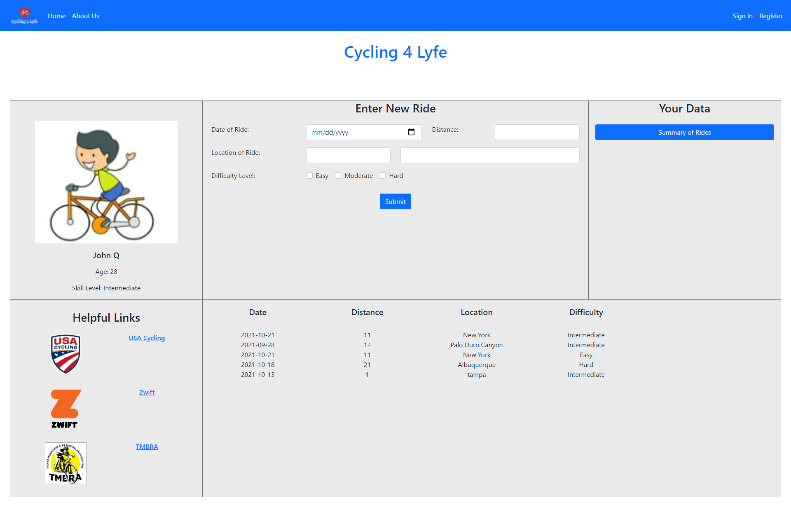

## Featured stack

    -Node
    -Express
    -Sequelize
    -PostgreSQL
    -bcrypt
    -Express ES6 Template Engine

## Install

    git clone https://github.com/Jakejenk/DC_Full_Stack.git

    npm install (installs all dependencies)

## Run

    npm start

## Links

- [Get started](https://react-hook-form.com/get-started)
- [API](https://react-hook-form.com/api)
- [Examples](https://github.com/bluebill1049/react-hook-form/tree/master/examples)
- [Demo](https://react-hook-form.com)
- [Form Builder](https://react-hook-form.com/form-builder)
- [FAQs](https://react-hook-form.com/faqs)

## Contributors

Thanks go to these wonderful people! [[Become a contributor](CONTRIBUTING.md)].

